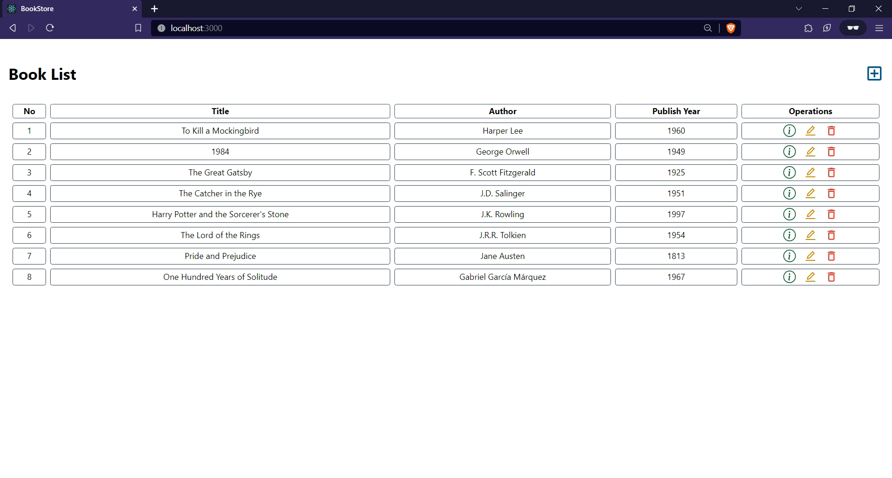
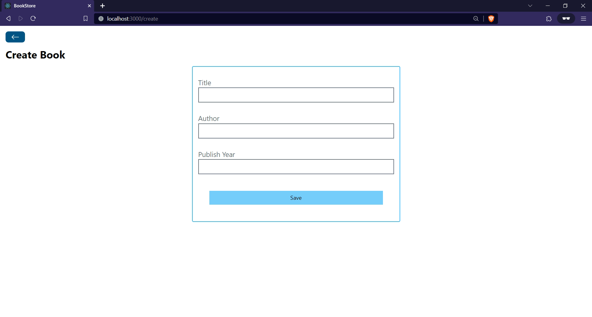
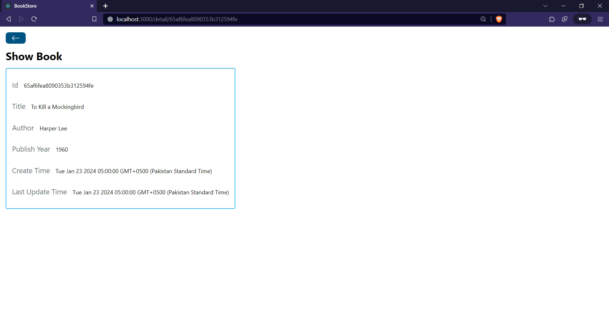
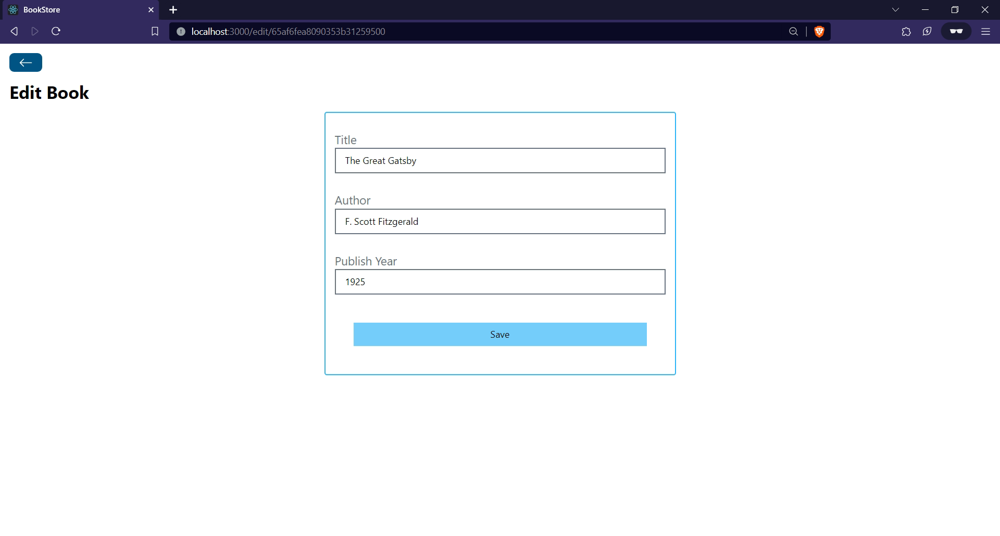
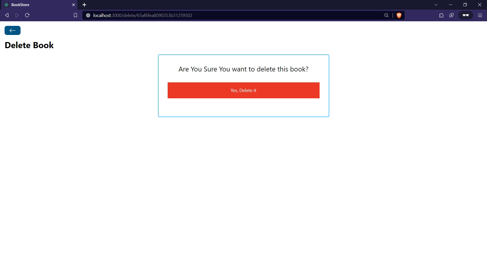

## Setting Up Environment Variables

1. In the `Backend` folder, create an `.env` file with the following content:

    ```env
    # backend/.env

    PORT=<backend-port>
    MONGODB_URI=<database-connection-string>
    ```

2. In the `Frontend` folder, create an `.env` file with the following content:

    ```env
    # frontend/.env

    REACT_APP_BACKEND_URL=<backend-url>
    ```

## Running the Application

In the root folder of the project, run the following command:

```bash
npm start
```
---
<details>
<summary><b>Screenshot</b></summary>
<br>
<br>
<br>
<br>

</details>
